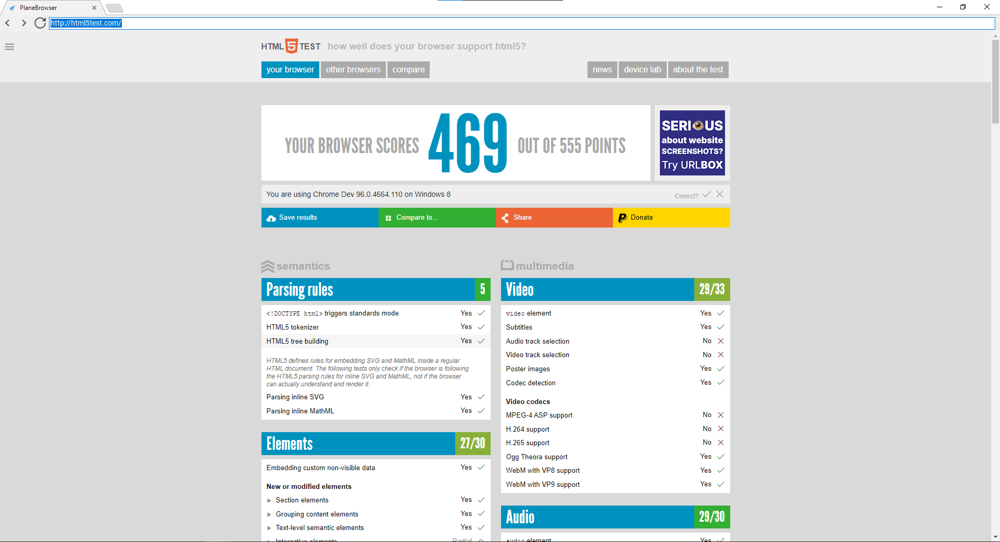
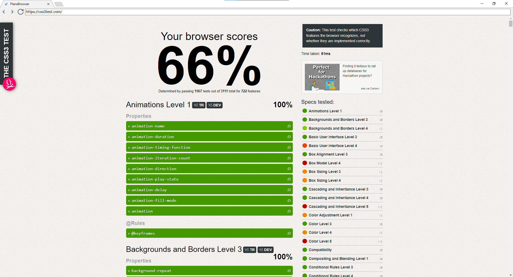

# PlaneBrowser for Windows
A simple chromium web browser.

### Get started 
- Clone repository using Visual Studio GIT system or download repository
- Open PlaneBrowser.sln in directory
- Done.

### Screenshots

### License
This software is licensed under [3-Clause BSD License.](./LICENSE)

### Other Licenses 
CefSharp: [Copyright © The CefSharp Authors. All rights reserved.](https://github.com/cefsharp/CefSharp/blob/master/LICENSE)

EasyTabs: [Copyright (c) 2020, Luke Stratman. All rights reserved.](https://github.com/lstratman/EasyTabs/blob/master/BSD.txt)

All icons by Icons8

### Remember: PlaneBrowser is free, cross platform and open source.
